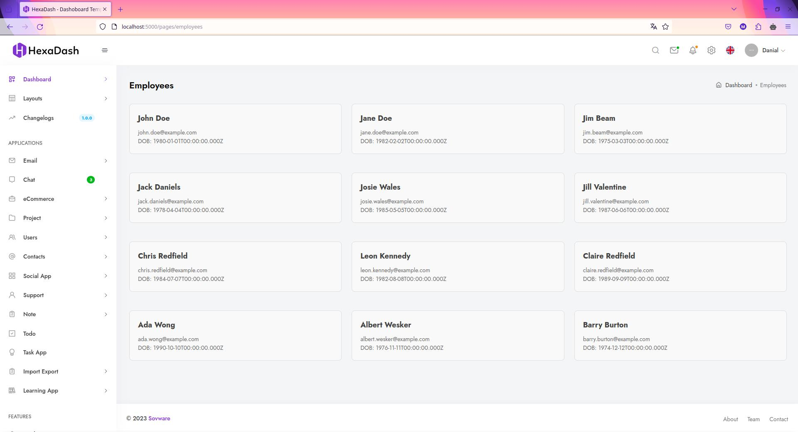
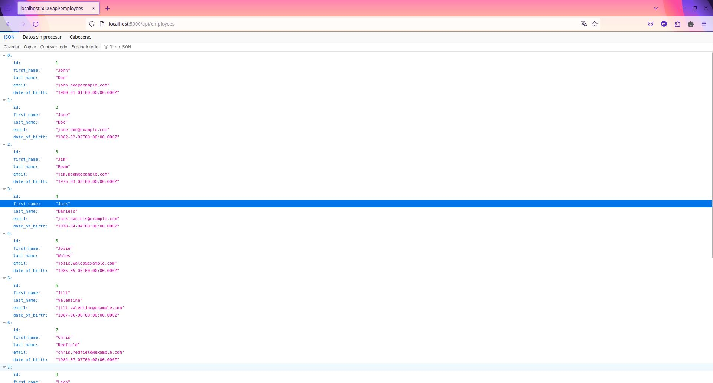

# create-svelte

Everything you need to build a Svelte project, powered by [`create-svelte`](https://github.com/sveltejs/kit/tree/master/packages/create-svelte).

## Creating a project

If you're seeing this, you've probably already done this step. Congrats!

```bash
# create a new project in the current directory
npm init svelte

# create a new project in my-app
npm init svelte my-app
```

## Developing

Once you've created a project and installed dependencies with `npm install` (or `pnpm install` or `yarn`), start a development server:

```bash
npm run dev

# or start the server and open the app in a new browser tab
npm run dev -- --open
```

## Building

To create a production version of your app:

```bash
npm run build
```

You can preview the production build with `npm run preview`.

> To deploy your app, you may need to install an [adapter](https://kit.svelte.dev/docs/adapters) for your target environment.


# Instructions for the test


Svelte/SvelteKit + PostgreSQL Development Setup
This guide outlines the steps to set up a development environment for a Svelte/SvelteKit application with PostgreSQL integration using docker-compose. This setup provides a local environment with sample data for testing purposes.

#### Prerequisites:

* Git: If you don't have Git installed, follow the instructions at https://git-scm.com/downloads.

* Docker: Install Docker Desktop from https://docs.docker.com/guides/walkthroughs/run-a-container/.


## This project include docker-compose so you can start and the Svelte/SvelteKit + PostgreSQL

#### 1. Clone this repository

> git clone git@github.com:manugrana2/hexadash.git

#### 2. Run docker compose 

This is start both a postgres database with sample data from ./data-sample.sql and the stelve service. 

> docker-compose up --build

### 3. Go to UI and API routes that uses the db connection localted at ./src/utils/db.js

* API http://localhost:5000/api/employees

* UI http://localhost:5000/pages/employees (You need to be logged in to see this route)


## Screenshots 

### UI 


### API 




# Starting this project Svelte/SvelteKit + A local PostgreSQL

1. Run content of ./data-sample.sql in your local database

2. Provide the database connection details in the enviroment variables as shown in .env.example 